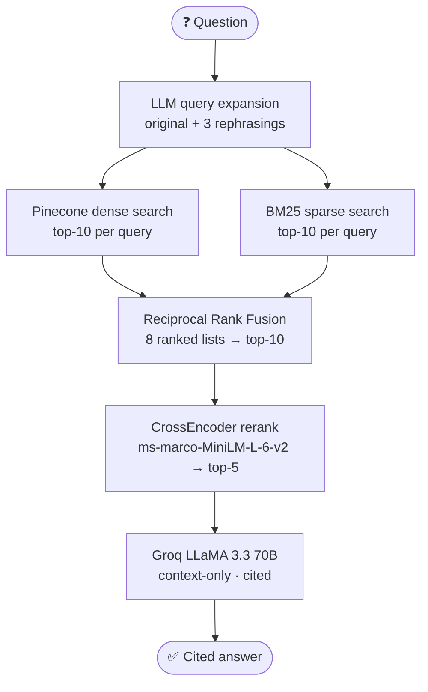

# 🧠 PCOS × Neurodivergence — Advanced RAG (Pinecone + Hybrid Search)

[](https://colab.research.google.com/github/mistyvisty/pcos-neurodivergence-advanced-rag-pinecone/blob/main/Advanced_RAG_Pinecone.ipynb)


> Upgrades my [baseline FAISS RAG](https://github.com/mistyvisty/pcos-neurodivergence-rag) with **Pinecone, BM25 hybrid search, Reciprocal Rank Fusion, CrossEncoder reranking and LLM query expansion**, then A/B tests both pipelines on the same 10 questions to see what the extra complexity actually buys.

---

## 🎯 The Question This Project Asks

"Advanced RAG" techniques are often added by default. I wanted to know: **on a small, focused corpus, does a hybrid + reranking stack actually retrieve better than plain dense search, and what does it cost?**

To keep the comparison fair, both pipelines use the **same 5 papers, the same 376 chunks, the same embedding model and the same LLM**. Only the retrieval stack changes.

---

## 🏗️ Architecture



**Baseline for comparison:** FAISS (cosine) → top-5 → same LLM and prompt. No expansion, no BM25, no reranking.

| Stage | Why it's there |
|---|---|
| **Query expansion** | Medical terms have many synonyms (PCOS / polycystic ovary syndrome, autism / ASD). Rephrasings widen recall |
| **BM25 + dense** | Dense search catches meaning; BM25 catches exact terms and abbreviations |
| **RRF** (k=60) | Merges ranked lists without needing comparable scores, so dense and BM25 combine cleanly |
| **CrossEncoder** | Reads query and passage *together*, which is more accurate but slow, so it runs only on the fused top-10 |

---

## 📊 A/B Test Results

10 questions, each run through both pipelines.

| Metric | Baseline (FAISS) | Advanced (Hybrid) |
|---|---|---|
| Average latency | **2.74s** | 4.46s (~1.6× slower) |
| Same set of papers retrieved | 7 / 10 questions | 7 / 10 questions |

**Where the retrieved papers differed:**

| Question | Baseline sources | Advanced sources |
|---|---|---|
| Link between PCOS and ADHD in offspring? | Berni, Dubey | Berni, **Cherskov**, Dubey |
| Prenatal sex steroid theory of autism? | Chen, Dubey | Chen |
| Outcomes measured in the Dubey meta-analysis? | Berni, Dubey | **Dubey only** (more focused) |

### 🔍 What I learned

1. **On a small, clean corpus, the hybrid stack mostly retrieved the same papers as plain dense search, at ~1.6× the latency.** With only 376 chunks from 5 focused papers, dense search is already strong, so the extra stages have little room to help.
2. **Both pipelines failed on "What sample size did the Berni et al. study use?"** Neither retrieved the Berni paper. The author name exists only in the chunk *metadata*, and most chunks don't contain the word "Berni" in their text, so neither embeddings nor BM25 can match it. **Fix:** prefix each chunk's text with its paper name before indexing.
3. **This A/B test measures latency and retrieved sources, not answer quality.** A proper retrieval-quality metric needs labeled relevant chunks per question. That's the next step below.

---

## 🛠️ Tech Stack

| Component | Tool |
|---|---|
| PDF extraction | PyMuPDF (`fitz`) |
| Chunking | LangChain `RecursiveCharacterTextSplitter` (800 chars, 100 overlap) |
| Embeddings | `all-MiniLM-L6-v2` (384-dim) |
| Dense store | Pinecone (serverless, cosine, AWS us-east-1) |
| Sparse retrieval | BM25 (`rank-bm25`) |
| Fusion | Reciprocal Rank Fusion (k=60) |
| Reranker | CrossEncoder `ms-marco-MiniLM-L-6-v2` |
| Query expansion + LLM | Groq — LLaMA 3.3 70B Versatile |
| Baseline | FAISS (inner product on normalized vectors) |

---

## 🗂️ Research Papers Used

> ⚠️ **PDFs are not included in this repo** because some are copyrighted. Download them using the links below and upload them when the notebook prompts you. **Keep the filenames exactly as shown.**

| Filename | Paper | Access |
|---|---|---|
| `pmos.pdf` | Cherskov et al. (2018) — *PCOS and Autism: A test of the prenatal sex steroid theory.* Translational Psychiatry. DOI: [10.1038/s41398-018-0186-7](https://doi.org/10.1038/s41398-018-0186-7) | 🔓 Open Access |
| `pmos1.pdf` | Redkar & Khan (2025) — *The impact of PCOS on attention: an empirical investigation.* BioPsychoSocial Medicine. DOI: [10.1186/s13030-024-00320-w](https://doi.org/10.1186/s13030-024-00320-w) | 🔓 Open Access |
| `pmos2.pdf` | Berni et al. (2018) — *PCOS is associated with adverse mental health and neurodevelopmental outcomes.* J Clin Endocrinol Metab. DOI: [10.1210/jc.2017-02667](https://doi.org/10.1210/jc.2017-02667) | 🔒 Paywall |
| `pmos3.pdf` | Dubey et al. (2021) — *Systematic review and meta-analysis: maternal PCOS and neuropsychiatric disorders in children.* Translational Psychiatry. DOI: [10.1038/s41398-021-01699-8](https://doi.org/10.1038/s41398-021-01699-8) | 🔓 Open Access |
| `pmos4.pdf` | Chen et al. (2020) — *PCOS or anovulatory infertility and offspring psychiatric disorders: a Finnish population-based cohort study.* Human Reproduction. DOI: [10.1093/humrep/deaa192](https://doi.org/10.1093/humrep/deaa192) | 🔓 Open Access |

> 💡 For the paywalled paper, try [Unpaywall](https://unpaywall.org) or your institution.

---

## 🚀 How to Run

**1. Open the notebook** — click **Open in Colab** at the top.

**2. Add two Colab secrets** (🔑 icon in the left sidebar → Add new secret → turn Notebook access ON):
- `PINECONE_API_KEY` — free at [pinecone.io](https://www.pinecone.io)
- `GROQ_API_KEY` — free at [console.groq.com](https://console.groq.com)

**3. Run all cells in order.** The notebook creates the Pinecone index (`pcos-rag`, 384-dim, cosine) automatically if it doesn't exist.

```
Step 0  → Install dependencies
Step 1  → Load API keys
Step 2  → Create / connect Pinecone index
Step 3  → Upload PDFs
Step 4  → Extract & chunk (identical to baseline)
Step 5  → Embed chunks
Step 6  → Build FAISS baseline pipeline
Step 7  → Upsert vectors into Pinecone
Step 8  → Build BM25 index
Step 9  → Pinecone dense search
Step 10 → Reciprocal Rank Fusion
Step 11 → CrossEncoder reranker
Step 12 → LLM query expansion
Step 13 → Full advanced pipeline
Step 14 → Sanity check (one question, both pipelines)
Step 15 → A/B test (10 questions, both pipelines)
Step 16 → Generate comparison table
Step 17 → Interactive Q&A widget
```

---

## 💬 Example Output

**Question:** *Are children of mothers with PCOS at higher risk of autism?*

**Advanced pipeline answer (excerpt):**
> According to Chen et al. (2020, p.6), women with PCOS had 35% increased odds of having a first-born child with autism, after adjusting for comorbid maternal psychiatric diagnosis, metabolic conditions, and complications in childbirth. This is further supported by Dubey et al. (2021, p.7), who found that maternal PCOS is associated with children with Autism Spectrum Disorder (ASD).

**Reranked chunks:**
```
[8.382] Chen et al. 2020 — Finnish Cohort Study p.6
[7.793] Chen et al. 2020 — Finnish Cohort Study p.6
[7.334] Chen et al. 2020 — Finnish Cohort Study p.2
[5.823] Dubey et al. 2021 — Maternal PCOS Meta-analysis p.7
[5.189] Dubey et al. 2021 — Maternal PCOS Meta-analysis p.7
```

---

## 🔧 Next Steps

- **Label relevant chunks for each test question** and measure Hit@5 and MRR for both pipelines. That turns this A/B test into a real retrieval-quality benchmark
- **Prefix each chunk with its paper name and year** before indexing, so author-specific questions (like the Berni one) can be retrieved
- **Ablation study:** add one stage at a time (BM25 → RRF → reranker → expansion) to see which stage, if any, adds value
- **Test on a larger, noisier corpus**, where hybrid search and reranking are expected to matter more

---

## 📁 Repo Structure

```
pcos-neurodivergence-advanced-rag-pinecone/
├── Advanced_RAG_Pinecone.ipynb   ← main notebook (with saved outputs)
├── requirements.txt
├── README.md
└── .gitignore                    ← excludes PDFs
```

---

## ⚠️ Disclaimer

This tool is for **research and educational purposes only**. It is not a medical diagnostic tool, and its answers should not be used as clinical advice. Always consult a qualified healthcare professional.

---

## 👩‍💻 Author

**Preeti Bhardwaj** — Software Developer | GenAI & Agentic Systems | RAG & LLM Engineering

[Portfolio](https://mistyvisty.github.io/) · [GitHub](https://github.com/mistyvisty) · [Medium](https://medium.com/@bhardwajpreeti357)
